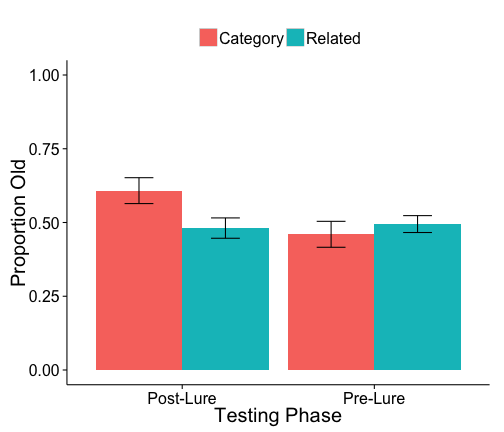
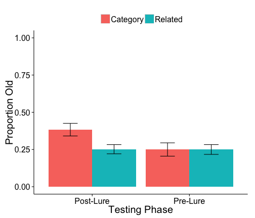
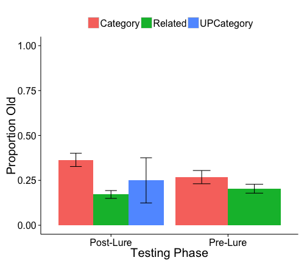
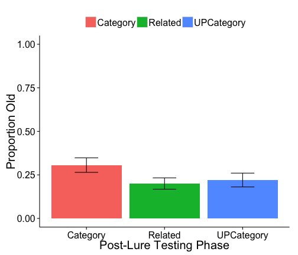
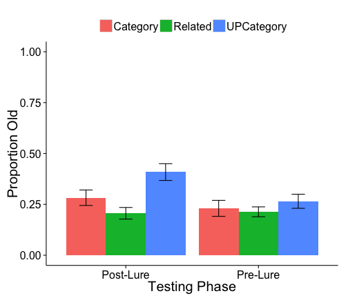
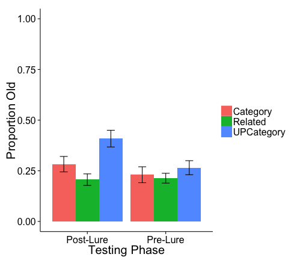

Test-induced Priming DRM experiments
------------------------------------


```r
require(ggplot2)
```

```
## Loading required package: ggplot2
```

```r
require(Crump)
```

```
## Loading required package: Crump
```


```r
Subject<-c()
Phase<-c()
Type<-c()
Memory<-c()
Confidence<-c()
CategoryWord<-c()
for (subnum in 5:55){
test<-scan(file="RawTurkData.txt", what = "character", sep = " ", skip=(0+subnum), nlines=1)
data<-unlist(strsplit(test,split=":"))
if (length(data)==161){
for(i in 2:161){
CurrentTrial<-unlist(strsplit(data[i],split=","))
Phase<-c(Phase,CurrentTrial[4])
Type<-c(Type,CurrentTrial[3])
Memory<-c(Memory,CurrentTrial[10])
Confidence<-c(Confidence,CurrentTrial[11])
Subject<-c(Subject,subnum)
CategoryWord<-c(CategoryWord,CurrentTrial[2])
}
}
}
Memory<-as.numeric(Memory)
AllData<-data.frame(Subject,Phase,Type,Memory,Confidence,CategoryWord)
AllData<-aggregate(Memory~Subject*Phase*Type,AllData,mean)
AllData$Subject<-factor(AllData$Subject)
aov.out<-aov(Memory~Phase*Type + Error(Subject/(Phase+Type)),AllData)
print(summary(aov.out),digits=10)
```

```
## 
## Error: Subject
##           Df   Sum Sq      Mean Sq F value Pr(>F)
## Residuals 49 9.906048 0.2021642449               
## 
## Error: Subject:Phase
##           Df      Sum Sq       Mean Sq F value    Pr(>F)   
## Phase      1 0.225792000 0.22579200000 8.18553 0.0061915 **
## Residuals 49 1.351630222 0.02758429025                     
## ---
## Signif. codes:  0 '***' 0.001 '**' 0.01 '*' 0.05 '.' 0.1 ' ' 1
## 
## Error: Subject:Type
##           Df       Sum Sq       Mean Sq F value   Pr(>F)  
## Type       1 0.1064142222 0.10641422222 4.26164 0.044297 *
## Residuals 49 1.2235413333 0.02497023129                   
## ---
## Signif. codes:  0 '***' 0.001 '**' 0.01 '*' 0.05 '.' 0.1 ' ' 1
## 
## Error: Within
##            Df      Sum Sq     Mean Sq F value    Pr(>F)   
## Phase:Type  1 0.326432000 0.326432000 8.44671 0.0054771 **
## Residuals  49 1.893656889 0.038646059                     
## ---
## Signif. codes:  0 '***' 0.001 '**' 0.01 '*' 0.05 '.' 0.1 ' ' 1
```

```r
print(model.tables(aov.out,"means"),digits=3) 
```

```
## Tables of means
## Grand mean
##           
## 0.5109333 
## 
##  Phase 
## Phase
## Post-Lure  Pre-Lure 
##     0.545     0.477 
## 
##  Type 
## Type
## Category  Related 
##    0.534    0.488 
## 
##  Phase:Type 
##            Type
## Phase       Category Related
##   Post-Lure 0.608    0.481  
##   Pre-Lure  0.460    0.495
```


```r
AllMeans<-aggregate(Memory~Phase*Type,AllData,mean)
Allstdes<-aggregate(Memory~Phase*Type,AllData,stde)
AllGood <- data.frame(AllMeans, stde = Allstdes$Memory)
limits <- aes(ymax = Memory + stde, ymin = Memory - stde)

ggplot(AllGood,aes(x=Phase, y=Memory, group=Type,fill=Type))+
  geom_bar(position="dodge",stat="identity")+
  geom_errorbar(limits,position=position_dodge(.9), width=.3)+
  theme_classic(base_size=20)+
  ylab("Proportion Old")+
  xlab("Testing Phase")+
  ylim(0,1)+
  theme(legend.position="top",
    legend.direction="horizontal",
    legend.title = element_blank())
```

 


E2 1 second
-----------


```r
Subject<-c()
Phase<-c()
Type<-c()
Memory<-c()
Confidence<-c()
for (subnum in 56:105){
  test<-scan(file="RawTurkData.txt", what = "character", sep = " ", skip=(0+subnum), nlines=1)
  data<-unlist(strsplit(test,split=":"))
if (length(data)==161){
for(i in 2:161){
      CurrentTrial<-unlist(strsplit(data[i],split=","))
      Phase<-c(Phase,CurrentTrial[4])
      Type<-c(Type,CurrentTrial[3])
      Memory<-c(Memory,CurrentTrial[10])
      Confidence<-c(Confidence,CurrentTrial[11])
      Subject<-c(Subject,subnum)
    }
  }
}
Memory<-as.numeric(Memory)
Confidence<-as.numeric(Confidence)
AllData<-data.frame(Subject,Phase,Type,Memory,Confidence)
AllData<-aggregate(Memory~Subject*Phase*Type,AllData,mean)
AllData$Subject<-factor(AllData$Subject)
aov.out<-aov(Memory~Phase*Type + Error(Subject/(Phase+Type)),AllData)
print(summary(aov.out),digits=10)
```

```
## 
## Error: Subject
##           Df     Sum Sq      Mean Sq F value Pr(>F)
## Residuals 47 9.60595463 0.2043820134               
## 
## Error: Subject:Phase
##           Df       Sum Sq       Mean Sq F value   Pr(>F)  
## Phase      1 0.2196009259 0.21960092593 6.84151 0.011936 *
## Residuals 47 1.5086212963 0.03209832545                   
## ---
## Signif. codes:  0 '***' 0.001 '**' 0.01 '*' 0.05 '.' 0.1 ' ' 1
## 
## Error: Subject:Type
##           Df       Sum Sq       Mean Sq  F value   Pr(>F)   
## Type       1 0.2071564815 0.20715648148 10.95122 0.001801 **
## Residuals 47 0.8890657407 0.01891629236                     
## ---
## Signif. codes:  0 '***' 0.001 '**' 0.01 '*' 0.05 '.' 0.1 ' ' 1
## 
## Error: Within
##            Df       Sum Sq       Mean Sq F value   Pr(>F)   
## Phase:Type  1 0.2071564815 0.20715648148 8.27172 0.006035 **
## Residuals  47 1.1770657407 0.02504395193                    
## ---
## Signif. codes:  0 '***' 0.001 '**' 0.01 '*' 0.05 '.' 0.1 ' ' 1
```

```r
print(model.tables(aov.out,"means"),digits=3) 
```

```
## Tables of means
## Grand mean
##           
## 0.2838194 
## 
##  Phase 
## Phase
## Post-Lure  Pre-Lure 
##     0.318     0.250 
## 
##  Type 
## Type
## Category  Related 
##    0.317    0.251 
## 
##  Phase:Type 
##            Type
## Phase       Category Related
##   Post-Lure 0.383    0.252  
##   Pre-Lure  0.250    0.250
```


```r
AllMeans<-aggregate(Memory~Phase*Type,AllData,mean)
Allstdes<-aggregate(Memory~Phase*Type,AllData,stde)
AllGood <- data.frame(AllMeans, stde = Allstdes$Memory)
limits <- aes(ymax = Memory + stde, ymin = Memory - stde)

ggplot(AllGood,aes(x=Phase, y=Memory, group=Type,fill=Type))+
  geom_bar(position="dodge",stat="identity")+
  geom_errorbar(limits,position=position_dodge(.9), width=.3)+
  theme_classic(base_size=20)+
  ylab("Proportion Old")+
  xlab("Testing Phase")+
  ylim(0,1)+
  theme(legend.position="top",
    legend.direction="horizontal",
    legend.title = element_blank())
```

 


E3 1 second with warning
------------------------


```r
Subject<-c()
Phase<-c()
Type<-c()
Memory<-c()
Confidence<-c()
for (subnum in 106:155){
  test<-scan(file="RawTurkData.txt", what = "character", sep = " ", skip=(0+subnum), nlines=1)
  data<-unlist(strsplit(test,split=":"))
if (length(data)==161){
for(i in 2:161){
      CurrentTrial<-unlist(strsplit(data[i],split=","))
      Phase<-c(Phase,CurrentTrial[4])
      Type<-c(Type,CurrentTrial[3])
      Memory<-c(Memory,CurrentTrial[10])
      Confidence<-c(Confidence,CurrentTrial[11])
      Subject<-c(Subject,subnum)
    }
  }
}
Memory<-as.numeric(Memory)
Confidence<-as.numeric(Confidence)
AllData<-data.frame(Subject,Phase,Type,Memory,Confidence)
AllData<-aggregate(Memory~Subject*Phase*Type,AllData,mean)
AllData$Subject<-factor(AllData$Subject)
aov.out<-aov(Memory~Phase*Type + Error(Subject/(Phase+Type)),AllData)
```

```
## Warning in aov(Memory ~ Phase * Type + Error(Subject/(Phase + Type)),
## AllData): Error() model is singular
```

```r
print(summary(aov.out),digits=10)
```

```
## 
## Error: Subject
##           Df      Sum Sq      Mean Sq F value Pr(>F)
## Phase      1 0.124049064 0.1240490638 1.00598 0.3209
## Residuals 48 5.918989037 0.1233122716               
## 
## Error: Subject:Phase
##           Df       Sum Sq       Mean Sq F value  Pr(>F)
## Phase      1 0.0411109818 0.04111098184 1.23570 0.27184
## Type       1 0.0223109880 0.02231098799 0.67062 0.41688
## Residuals 48 1.5969283250 0.03326934010                
## 
## Error: Subject:Type
##           Df       Sum Sq      Mean Sq  F value     Pr(>F)    
## Type       2 0.8495238095 0.4247619048 20.92911 2.1469e-07 ***
## Residuals 52 1.0553541950 0.0202952730                        
## ---
## Signif. codes:  0 '***' 0.001 '**' 0.01 '*' 0.05 '.' 0.1 ' ' 1
## 
## Error: Within
##            Df       Sum Sq       Mean Sq  F value     Pr(>F)    
## Phase:Type  1 0.2050438821 0.20504388209 12.71044 0.00082306 ***
## Residuals  49 0.7904645079 0.01613192873                        
## ---
## Signif. codes:  0 '***' 0.001 '**' 0.01 '*' 0.05 '.' 0.1 ' ' 1
```

```r
print(model.tables(aov.out,"means"),digits=3) 
```

```
## Error in colSums(eff): 'x' must be an array of at least two dimensions
```


```r
AllMeans<-aggregate(Memory~Phase*Type,AllData,mean)
Allstdes<-aggregate(Memory~Phase*Type,AllData,stde)
AllGood <- data.frame(AllMeans, stde = Allstdes$Memory)
limits <- aes(ymax = Memory + stde, ymin = Memory - stde)

ggplot(AllGood,aes(x=Phase, y=Memory, group=Type,fill=Type))+
  geom_bar(position="dodge",stat="identity")+
  geom_errorbar(limits,position=position_dodge(.9), width=.3)+
  theme_classic(base_size=20)+
  ylab("Proportion Old")+
  xlab("Testing Phase")+
  ylim(0,1)+
  theme(legend.position="top",
    legend.direction="horizontal",
    legend.title = element_blank())
```

 


E4 1 second with warning with control words
--------------------------------------------


```r
Subject<-c()
Phase<-c()
Type<-c()
Memory<-c()
Confidence<-c()
for (subnum in 156:204){
  test<-scan(file="RawTurkData.txt", what = "character", sep = " ", skip=(0+subnum), nlines=1)
  data<-unlist(strsplit(test,split=":"))
if (length(data)==161){
for(i in 2:161){
      CurrentTrial<-unlist(strsplit(data[i],split=","))
      Phase<-c(Phase,CurrentTrial[4])
      Type<-c(Type,CurrentTrial[3])
      Memory<-c(Memory,CurrentTrial[10])
      Confidence<-c(Confidence,CurrentTrial[11])
      Subject<-c(Subject,subnum)
    }
  }
}
Memory<-as.numeric(Memory)
Confidence<-as.numeric(Confidence)
AllData<-data.frame(Subject,Phase,Type,Memory,Confidence)
AllData<-aggregate(Memory~Subject*Phase*Type,AllData,mean)
AllData$Subject<-factor(AllData$Subject)
AllData<-AllData[AllData$Phase=="Post-Lure",]
aov.out<-aov(Memory~Type + Error(Subject/(Type)),AllData)
print(summary(aov.out),digits=10)
```

```
## 
## Error: Subject
##           Df      Sum Sq      Mean Sq F value Pr(>F)
## Residuals 48 8.367024851 0.1743130177               
## 
## Error: Subject:Type
##           Df       Sum Sq       Mean Sq F value     Pr(>F)    
## Type       2 0.3095460225 0.15477301125 7.77953 0.00073924 ***
## Residuals 96 1.9099097598 0.01989489333                       
## ---
## Signif. codes:  0 '***' 0.001 '**' 0.01 '*' 0.05 '.' 0.1 ' ' 1
```

```r
print(model.tables(aov.out,"means"),digits=3) 
```

```
## Tables of means
## Grand mean
##           
## 0.2422741 
## 
##  Type 
## Type
##   Category    Related UPCategory 
##     0.3061     0.2003     0.2204
```


```r
AllMeans<-aggregate(Memory~Type,AllData,mean)
Allstdes<-aggregate(Memory~Type,AllData,stde)
AllGood <- data.frame(AllMeans, stde = Allstdes$Memory)
limits <- aes(ymax = Memory + stde, ymin = Memory - stde)

ggplot(AllGood,aes(x=Type, y=Memory, group=Type,fill=Type))+
  geom_bar(position="dodge",stat="identity")+
  geom_errorbar(limits,position=position_dodge(.9), width=.3)+
  theme_classic(base_size=20)+
  ylab("Proportion Old")+
  xlab("Post-Lure Testing Phase")+
  ylim(0,1)+
  theme(legend.position="top",
    legend.direction="horizontal",
    legend.title = element_blank())
```

 


E5 1 second with warning with control words, and RP words
--------------------------------------------


```r
Subject<-c()
Phase<-c()
Type<-c()
Memory<-c()
Confidence<-c()
for (subnum in 206:255){
  test<-scan(file="RawTurkData.txt", what = "character", sep = " ", skip=(0+subnum), nlines=1)
  data<-unlist(strsplit(test,split=":"))
if (length(data)==161){
for(i in 2:161){
      CurrentTrial<-unlist(strsplit(data[i],split=","))
      Phase<-c(Phase,CurrentTrial[4])
      Type<-c(Type,CurrentTrial[3])
      Memory<-c(Memory,CurrentTrial[10])
      Confidence<-c(Confidence,CurrentTrial[11])
      Subject<-c(Subject,subnum)
    }
  }
}
Memory<-as.numeric(Memory)
Confidence<-as.numeric(Confidence)
AllData<-data.frame(Subject,Phase,Type,Memory,Confidence)
AllData<-aggregate(Memory~Subject*Phase*Type,AllData,mean)
AllData$Subject<-factor(AllData$Subject)
#AllData<-AllData[AllData$Phase=="Post-Lure",]
aov.out<-aov(Memory~Phase*Type + Error(Subject/(Phase+Type)),AllData)
print(summary(aov.out),digits=10)
```

```
## 
## Error: Subject
##           Df      Sum Sq      Mean Sq F value Pr(>F)
## Residuals 45 9.316510648 0.2070335699               
## 
## Error: Subject:Phase
##           Df       Sum Sq      Mean Sq F value    Pr(>F)   
## Phase      1 0.2724408459 0.2724408459 8.55719 0.0053753 **
## Residuals 45 1.4326952085 0.0318376713                     
## ---
## Signif. codes:  0 '***' 0.001 '**' 0.01 '*' 0.05 '.' 0.1 ' ' 1
## 
## Error: Subject:Type
##           Df       Sum Sq      Mean Sq  F value     Pr(>F)    
## Type       2 0.7613768116 0.3806884058 14.50074 3.4758e-06 ***
## Residuals 90 2.3627728483 0.0262530316                        
## ---
## Signif. codes:  0 '***' 0.001 '**' 0.01 '*' 0.05 '.' 0.1 ' ' 1
## 
## Error: Within
##            Df      Sum Sq       Mean Sq F value    Pr(>F)   
## Phase:Type  2 0.264819580 0.13240979000  5.9763 0.0036559 **
## Residuals  90 1.994023957 0.02215582175                     
## ---
## Signif. codes:  0 '***' 0.001 '**' 0.01 '*' 0.05 '.' 0.1 ' ' 1
```

```r
print(model.tables(aov.out,"means"),digits=3) 
```

```
## Tables of means
## Grand mean
##           
## 0.2677536 
## 
##  Phase 
## Phase
## Post-Lure  Pre-Lure 
##    0.2992    0.2363 
## 
##  Type 
## Type
##   Category    Related UPCategory 
##      0.257      0.210      0.337 
## 
##  Phase:Type 
##            Type
## Phase       Category Related UPCategory
##   Post-Lure 0.283    0.206   0.409     
##   Pre-Lure  0.230    0.213   0.265
```


```r
AllMeans<-aggregate(Memory~Phase*Type,AllData,mean)
Allstdes<-aggregate(Memory~Phase*Type,AllData,stde)
AllGood <- data.frame(AllMeans, stde = Allstdes$Memory)
limits <- aes(ymax = Memory + stde, ymin = Memory - stde)

ggplot(AllGood,aes(x=Phase, y=Memory, group=Type,fill=Type))+
  geom_bar(position="dodge",stat="identity")+
  geom_errorbar(limits,position=position_dodge(.9), width=.3)+
  theme_classic(base_size=20)+
  ylab("Proportion Old")+
  xlab("Testing Phase")+
  ylim(0,1)+
  theme(legend.position="top",
    legend.direction="horizontal",
    legend.title = element_blank())
```

 


# E6 1 second with warning with control words presented twice


```r
Subject<-c()
Phase<-c()
Type<-c()
Memory<-c()
Confidence<-c()
for (subnum in 256:321){
  test<-scan(file="RawTurkData.txt", what = "character", sep = " ", skip=(0+subnum), nlines=1)
  data<-unlist(strsplit(test,split=":"))
 if (length(data)==161){
for(i in 2:161){
      CurrentTrial<-unlist(strsplit(data[i],split=","))
      Phase<-c(Phase,CurrentTrial[4])
      Type<-c(Type,CurrentTrial[3])
      Memory<-c(Memory,CurrentTrial[11])
      Confidence<-c(Confidence,CurrentTrial[12])
      Subject<-c(Subject,subnum)
    }
  }
}
Memory<-as.numeric(Memory)
Confidence<-as.numeric(Confidence)
AllData<-data.frame(Subject,Phase,Type,Memory,Confidence)
AllData<-aggregate(Memory~Subject*Phase*Type,AllData,mean)
```

```
## Error in model.frame.default(formula = Memory ~ Subject * Phase * Type, : invalid type (NULL) for variable 'Subject'
```

```r
AllData$Subject<-factor(AllData$Subject)
#AllData<-AllData[AllData$Phase=="Post-Lure",]
#aov.out<-aov(Memory~Type + Error(Subject/(Type)),AllData)
#print(summary(aov.out),digits=10)
#print(model.tables(aov.out,"means"),digits=3) 
```


```r
AllMeans<-aggregate(Memory~Phase*Type,AllData,mean)
```

```
## Error in model.frame.default(formula = Memory ~ Phase * Type, data = AllData): invalid type (NULL) for variable 'Phase'
```

```r
Allstdes<-aggregate(Memory~Phase*Type,AllData,stde)
```

```
## Error in model.frame.default(formula = Memory ~ Phase * Type, data = AllData): invalid type (NULL) for variable 'Phase'
```

```r
AllGood <- data.frame(AllMeans, stde = Allstdes$Memory)
limits <- aes(ymax = Memory + stde, ymin = Memory - stde)

ggplot(AllGood,aes(x=Phase, y=Memory, group=Type,fill=Type))+
  geom_bar(position="dodge",stat="identity")+
  geom_errorbar(limits,position=position_dodge(.9), width=.3)+
  theme_classic(base_size=20)+
  ylab("Proportion Old")+
  xlab("Testing Phase")+
  ylim(0,1)+
  theme(legend.position="right",
    legend.direction="vertical",
    legend.title = element_blank())
```

 


